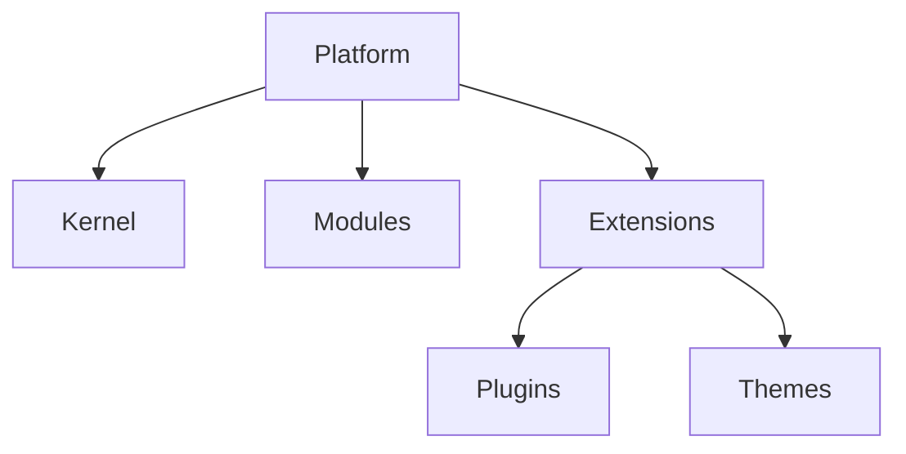

# Architecture

Conceptual architecture for JodKit during the **Architecture / Research** phase (walking skeleton next). **Selected / Accepted:** Fastify, PostgreSQL, [ADR-001](research/adr-001-drizzle-data-layer.md), [ADR-002](research/adr-002-api-architecture.md). **Proposed stack v0.2:** [research/stack-direction-v0.2.md](research/stack-direction-v0.2.md). **Public release** waits on license ADR - see [roadmap](roadmap.md). **Agents:** [AGENTS.md](../AGENTS.md).

## Platform layers



```text
                         PLATFORM
                            |
        +-------------------+-------------------+
        |                   |                   |
      Kernel             Modules             Extensions
        |                   |                   |
      Config         CMS, Auth, Media, ...    Plugins, Themes
      DI, Events,    Ecommerce, SEO, ...     Providers, Overrides
      Permissions,
      Lifecycle,
      DB/Cache/Storage/Queue abstractions
```

**Terminology:** **Platform** = the whole product stack. **Kernel** = minimal core infrastructure (informal prose may say "core"). **Modules** = optional platform capabilities. **Extensions** = **Plugins** and **Themes** (extension types grouped under the platform; not a separate runtime layer competing with modules).

## Stack direction (summary)

```text
Frontend (Next.js default, proposed) -> API (REST+OpenAPI+GraphQL+MCP, proposed)
        -> Fastify (selected) -> Kernel -> Modules / Plugins / Themes
        -> JodKit Data Layer (proposed: Drizzle + SQL escape) -> PostgreSQL (selected)
```

Libraries provide infrastructure; JodKit owns contracts. Detail: [stack-direction-v0.2.md](research/stack-direction-v0.2.md).

## Kernel (small by design)

Infrastructure only: configuration, DI, module/plugin loading, lifecycle, events, hooks, permissions, database/cache/storage/queue abstractions, logging, security primitives, API registration, capability registry.

**Not in kernel:** products, orders, posts, shipping rules, payment vendors, forms, SEO business logic - those belong in **modules**.

## Extensibility: events, filters, overrides

- **Events** - something happened (`order.created`, `post.published`).
- **Filters** - transform a value (`checkout.total`, `email.content`).
- **Overrides** - decorate or replace a registered service (`commerce.checkout.calculateTotal`).

**Override resolution order (conceptual):** Site override -> child theme -> theme -> plugin -> platform default.

## CMS and admin (conceptual)

- **Schema-driven CMS** - `defineCollection` / field definitions drive DB shape, validation, types, admin UI, APIs, permissions, search, webhooks, MCP tools.
- **Metadata-driven admin** - field types (`text`, `money`, `relation`, ...) drive labels, validation, formatting, filters, and API representation without one-off screens per module.

## API surface

**Proposed:** REST + OpenAPI baseline, GraphQL for complex clients, MCP for AI; tRPC not a public platform contract. Collections should ideally **auto-expose** REST/GraphQL/OpenAPI/types/webhooks/MCP from schema (generation design: research required).

## Frontend independence

**Proposed:** Next.js as default distribution adapter only. Platform core stays frontend-agnostic; Astro, Nuxt, SvelteKit, mobile, API-only clients remain valid.

## Infrastructure patterns

| Concern | Direction |
|---------|-----------|
| **Database** | **PostgreSQL (selected)**; Drizzle + SQL escape hatch (**Accepted**, [ADR-001](research/adr-001-drizzle-data-layer.md)) |
| **API** | REST + OpenAPI + optional GraphQL + MCP (**Accepted**, [ADR-002](research/adr-002-api-architecture.md)) |
| **Search** | **Proposed:** PostgreSQL baseline; SearchProvider for external engines |
| **Cache / queue** | **Proposed:** BullMQ with PostgreSQL backend first; Redis optional later |
| **Storage** | Provider-based (local, S3-compatible, ...) |
| **Deployment** | Primary target: single VPS (frontend + backend + PostgreSQL + optional Redis/workers); split deploy (e.g. edge frontend + VPS backend) must also work |
| **Multi-site** | VPS hosts multiple isolated sites; site management layer separate from core app architecture |

## Security, versioning, migrations

Security from day one: authz/RBAC, API hardening, webhook verification, secrets, audit logs, plugin permissions, cross-site isolation.

Explicit compatibility: platform, modules, plugins, themes, schema, API. CLI should block incompatible installs/upgrades. Migrations are first-class for platform, modules, and plugins.

## First implementation sequence (after research)

Kernel -> module system -> plugin system -> schema/content -> admin -> API -> theme system -> AI tooling - then incremental capabilities.

## Future monorepo shape (documented only)

When implementation starts, the repo may use `packages/`, `modules/`, `plugins/`, `themes/` - see [Foundation - Intended future repository layout](project-foundation-v0.1.md#intended-future-repository-layout-not-implemented-yet). **Do not create empty directories during research.**

---

**Full detail:** [Foundation section 6-7](project-foundation-v0.1.md#6-platform-architecture) | [section 15-16 Hooks & overrides](project-foundation-v0.1.md#15-hooks-events-and-overrides) | [section 18-20 Frontend, CMS, admin](project-foundation-v0.1.md#18-frontend-framework-independence) | [section 24-25 API](project-foundation-v0.1.md#24-api-architecture) | [section 34-42 Deployment & data](project-foundation-v0.1.md#34-deployment) | [section 56 Implementation order](project-foundation-v0.1.md#56-first-implementation-philosophy)
