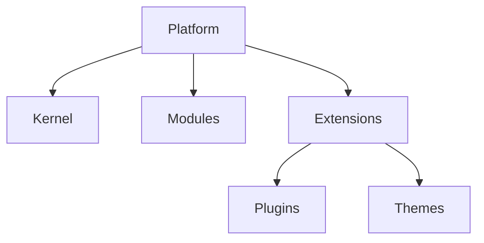

# Architecture

Conceptual architecture for JodKit during the **Architecture / Research** phase. Stack choices (backend framework, ORM, default frontend) are **not** finalized - see [roadmap](roadmap.md).

## Platform layers



```text
                         PLATFORM
                            |
        +-------------------+-------------------+
        |                   |                   |
      Kernel             Modules             Extensions
        |                   |                   |
      Config         CMS, Auth, Media, ...    Plugins, Themes
      DI, Events,    Ecommerce, SEO, ...     Providers, Overrides
      Permissions,
      Lifecycle,
      DB/Cache/Storage/Queue abstractions
```

**Terminology:** **Platform** = the whole product stack. **Kernel** = minimal core infrastructure (informal prose may say "core"). **Modules** = optional platform capabilities. **Extensions** = **Plugins** and **Themes** (extension types grouped under the platform; not a separate runtime layer competing with modules).

## Kernel (small by design)

Infrastructure only: configuration, DI, module/plugin loading, lifecycle, events, hooks, permissions, database/cache/storage/queue abstractions, logging, security primitives, API registration, capability registry.

**Not in kernel:** products, orders, posts, shipping rules, payment vendors, forms, SEO business logic - those belong in **modules**.

## Extensibility: events, filters, overrides

- **Events** - something happened (`order.created`, `post.published`).
- **Filters** - transform a value (`checkout.total`, `email.content`).
- **Overrides** - decorate or replace a registered service (`commerce.checkout.calculateTotal`).

**Override resolution order (conceptual):** Site override -> child theme -> theme -> plugin -> platform default.

## CMS and admin (conceptual)

- **Schema-driven CMS** - `defineCollection` / field definitions drive DB shape, validation, types, admin UI, APIs, permissions, search, webhooks, MCP tools.
- **Metadata-driven admin** - field types (`text`, `money`, `relation`, ...) drive labels, validation, formatting, filters, and API representation without one-off screens per module.

## API surface

Multiple layers over the same capabilities: internal TypeScript services, REST, OpenAPI, GraphQL (candidates), webhooks, TypeScript SDK, MCP. Collections should ideally **auto-expose** REST/GraphQL/OpenAPI/types/webhooks/MCP from schema.

## Frontend independence

Backend must not depend on a single frontend framework. Next.js, Astro, Nuxt, Svelte, mobile, or API-only clients are **candidates**; backend exposes stable contracts.

## Infrastructure patterns

| Concern | Direction |
|---------|-----------|
| **Database** | PostgreSQL is the leading **candidate**; ORM/query layer TBD |
| **Search** | Modular: PostgreSQL first, optional Meilisearch/Typesense/Elasticsearch providers |
| **Cache / queue** | Optional; basic CMS should not require Redis |
| **Storage** | Provider-based (local, S3-compatible, ...) |
| **Deployment** | Primary target: single VPS (frontend + backend + PostgreSQL + optional Redis/workers); split deploy (e.g. edge frontend + VPS backend) must also work |
| **Multi-site** | VPS hosts multiple isolated sites; site management layer separate from core app architecture |

## Security, versioning, migrations

Security from day one: authz/RBAC, API hardening, webhook verification, secrets, audit logs, plugin permissions, cross-site isolation.

Explicit compatibility: platform, modules, plugins, themes, schema, API. CLI should block incompatible installs/upgrades. Migrations are first-class for platform, modules, and plugins.

## First implementation sequence (after research)

Kernel -> module system -> plugin system -> schema/content -> admin -> API -> theme system -> AI tooling - then incremental capabilities.

## Future monorepo shape (documented only)

When implementation starts, the repo may use `packages/`, `modules/`, `plugins/`, `themes/` - see [Foundation - Intended future repository layout](project-foundation-v0.1.md#intended-future-repository-layout-not-implemented-yet). **Do not create empty directories during research.**

---

**Full detail:** [Foundation section 6-7](project-foundation-v0.1.md#6-platform-architecture) | [section 15-16 Hooks & overrides](project-foundation-v0.1.md#15-hooks-events-and-overrides) | [section 18-20 Frontend, CMS, admin](project-foundation-v0.1.md#18-frontend-framework-independence) | [section 24-25 API](project-foundation-v0.1.md#24-api-architecture) | [section 34-42 Deployment & data](project-foundation-v0.1.md#34-deployment) | [section 56 Implementation order](project-foundation-v0.1.md#56-first-implementation-philosophy)
